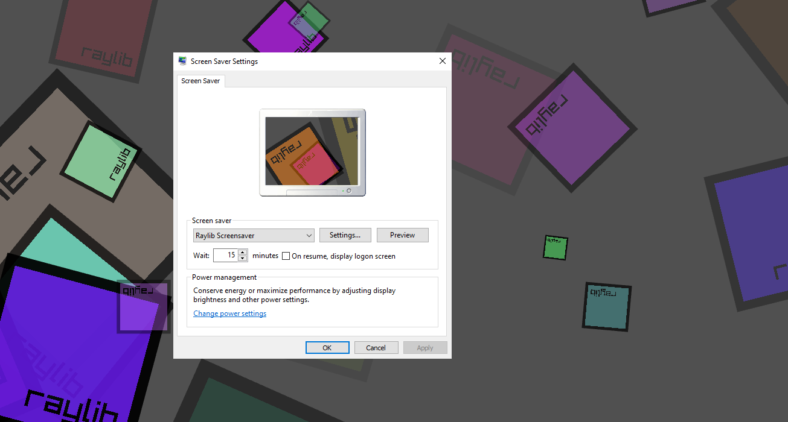

# Raylib Screensaver

This is a solution on how to make native windows screensavers using raylib.
You can make your own screensavers with 3D using Raylib!

## How to use

- Simply open the solution with either Visual Studio 2019 or 2022 Community Edition. 
- Compile a release version and check in the folder "vsproject/Release". There should be a file raylibscreensaver.scr.
- Right click the file and click install

If you get the error "fatal error RC1015: cannot open include file 'afxres.h'" then you have to install Microsoft Foundation Classes (MFC)
- Open the Control Panel
- Search for Programs and Features
- Search for Microsoft Visual Studio 
- Click Change/Modify
- Under featues search for  Microsoft Foundation Classes v141.

## Credits

By Rico Possienka

Using some code from https://github.com/ejensen/minimalclock-screensaver
